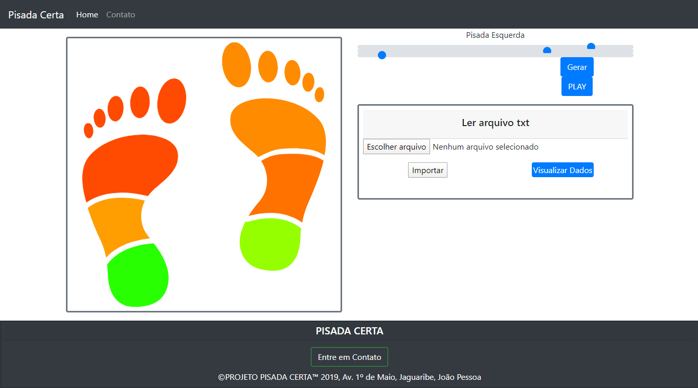

# Pisada Certa
Sistema Web o qual imprime de forma lúdica, os dados adquiridos por pisadas de uma pessoa, através de sensores de pressão, localizados em uma palmilha. Projeto criado na disciplina de Processamento Digital de Sinais no curso do Bacharelado em Engenharia Elétrica ofertado pelo IFPB Campus João Pessoa. 
Este projeto inclue dos graduandos Mateus Gomes, Ruan Castro, Carlos Henrique e Álef Huan.

## Layout

## Como funciona?
Com o protótipo contruído é possível salvar os dados em tempo real em um MicroSD Card, no formato .txt.
Com este aquivo .txt, podemos importá-lo no nosso sistema Web e visualizar os dados em uma tabela, ou apertando "PLAY", visualizamos em animação na figura do pé direito. Enquanto o pé esquerdo, podemos modicar os valores com os "ranges".
